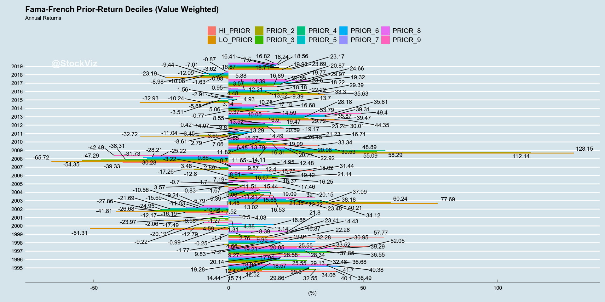
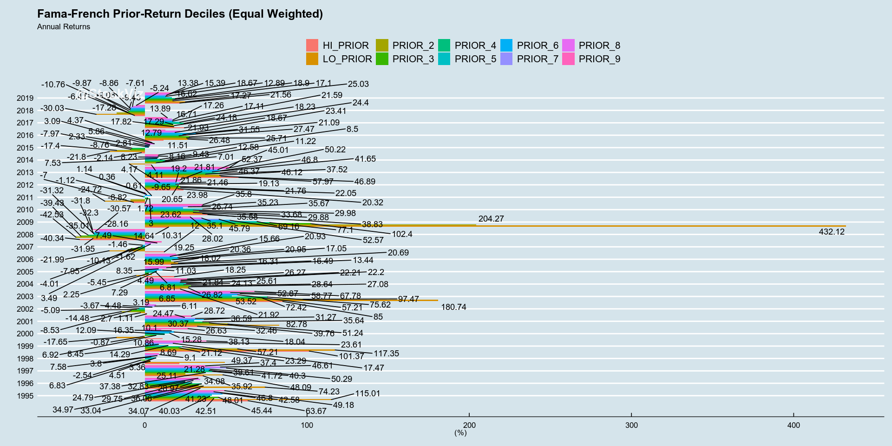

# Momentum Decile Performance

The [Fama-French](https://mba.tuck.dartmouth.edu/pages/faculty/ken.french/Data_Library/det_10_port_form_pr_12_2_daily.html) data-set has returns for portfolios constructed out of each decile of prior returns. Labeled LO_PRIOR, PRIOR_2..9 and HI_PRIOR, they represent portfolios who's prior returns were the lowest through to the highest.

Here, we plot the returns of these portfolios to get a sense for how they have behaved through time.

The documentation for the Fama-French data-set can be found [here](https://plutopy.readthedocs.io/en/latest/FamaFrench.html) and [here](https://shyams80.github.io/plutoR/docs/reference/FamaFrench-class.html)


```R
library(tidyverse)
library(ggthemes)
library(odbc)
library(plutoR)
library(quantmod)
library(lubridate)
library(reshape2)
library(PerformanceAnalytics)
library(ggrepel)
library(tbl2xts)

options("scipen"=999)
options(stringsAsFactors = FALSE)

source("config.R")
source("goofy/plot.common.R")

#initialize
famaFrench <- FamaFrench()
```

    ── Attaching packages ─────────────────────────────────────── tidyverse 1.2.1 ──
    ✔ ggplot2 3.2.1     ✔ purrr   0.3.2
    ✔ tibble  2.1.3     ✔ dplyr   0.8.3
    ✔ tidyr   0.8.3     ✔ stringr 1.4.0
    ✔ readr   1.3.1     ✔ forcats 0.4.0
    ── Conflicts ────────────────────────────────────────── tidyverse_conflicts() ──
    ✖ dplyr::filter() masks stats::filter()
    ✖ dplyr::lag()    masks stats::lag()
    Loading required package: xts
    Loading required package: zoo
    
    Attaching package: ‘zoo’
    
    The following objects are masked from ‘package:base’:
    
        as.Date, as.Date.numeric
    
    Registered S3 method overwritten by 'xts':
      method     from
      as.zoo.xts zoo 
    
    Attaching package: ‘xts’
    
    The following objects are masked from ‘package:dplyr’:
    
        first, last
    
    Loading required package: TTR
    Registered S3 method overwritten by 'quantmod':
      method            from
      as.zoo.data.frame zoo 
    Version 0.4-0 included new data defaults. See ?getSymbols.
    
    Attaching package: ‘lubridate’
    
    The following object is masked from ‘package:base’:
    
        date
    
    
    Attaching package: ‘reshape2’
    
    The following object is masked from ‘package:tidyr’:
    
        smiths
    
    
    Attaching package: ‘PerformanceAnalytics’
    
    The following object is masked from ‘package:graphics’:
    
        legend
    
    Registering fonts with R


```R
calcYearlyReturns <- function(priceXts){
    yRets <- NULL
    for(j in 1:ncol(priceXts)){
        yRets <- merge.xts(yRets, yearlyReturn(priceXts[,j]))
    }
    
    names(yRets) <- names(priceXts)
    return(yRets)
}
```


```R
#startDt <- (famaFrench$MomentumDaily() %>% summarize(MAX = min(TIME_STAMP)) %>% collect())$MAX[[1]]
startDt <- as.Date("1995-01-01")

#value (market-cap) weighted
valueWtd <- famaFrench$MomentumDaily() %>%
    filter(RET_TYPE == 'AVWRD' & TIME_STAMP >= startDt) %>%
    mutate(R = RET/100) %>%
    select(DATE = TIME_STAMP, KEY_ID, R) %>%
    collect() %>% 
    # the KEY_ID column has decile names HI_PRIOR...LO_PRIOR
    # we want HI_PRIOR...LO_PRIOR as column names
    mutate(group=1) %>%
    spread(KEY_ID, R) %>%
    select(-group)
    
valueWtdPx <- valueWtd %>% 
    # transform the return stream to prices
    # and convert to xts
    mutate_each(list(~ cumprod(. + 1) ), -DATE) %>% 
    tbl_xts() 

valueWtdYearlyRet <- 100*calcYearlyReturns(valueWtdPx)
valueWtdDailyRet <- valueWtd %>% 
    tbl_xts()

#equal weighted
equalWtd <- famaFrench$MomentumDaily() %>%
    filter(RET_TYPE == 'AEWRD' & TIME_STAMP >= startDt) %>%
    mutate(R = RET/100) %>%
    select(DATE = TIME_STAMP, KEY_ID, R) %>%
    collect() %>% 
    # the KEY_ID column has decile names HI_PRIOR...LO_PRIOR
    # we want HI_PRIOR...LO_PRIOR as column names
    mutate(group=1) %>%
    spread(KEY_ID, R) %>%
    select(-group)
    
equalWtdPx <- equalWtd %>% 
    # transform the return stream to prices
    # and convert to xts
    mutate_each(list(~ cumprod(. + 1) ), -DATE) %>% 
    tbl_xts() 

equalWtdYearlyRet <- 100*calcYearlyReturns(equalWtdPx)
equalWtdDailyRet <- equalWtd %>% 
    tbl_xts()

```


```R
options(repr.plot.width=18, repr.plot.height=10)
```


```R
Common.PlotCumReturns(valueWtdDailyRet, "Prior-Return Deciles (Value-weight)", "Fama-French")
print("Fama-French Prior-Return Deciles (Value Weighted) Annual Returns")
print(valueWtdYearlyRet)
```

    [1] "Fama-French Prior-Return Deciles (Value Weighted) Annual Returns"
                  HI_PRIOR    LO_PRIOR     PRIOR_2     PRIOR_3     PRIOR_4
    1995-12-29  40.0979833  12.5195158  34.0551908  32.5467314  29.8637741
    1996-12-31  15.7145986  12.4727189  14.4362289  29.1266659  18.5698960
    1997-12-31  26.5767082   9.2714806  20.1396408  37.8502317  36.5475700
    1998-12-31  52.0513721   4.6637873  -1.7693068   9.8320412  20.0509316
    1999-12-31  57.7701748  16.8707563  14.4289922   9.9519918  -0.2480109
    2000-12-29 -20.1944270 -51.3146326 -12.7921193  -0.9927498  13.1444042
    2001-12-31   1.3140769 -23.9695894  -1.2711116  -8.5841512 -12.1694761
    2002-12-31 -16.1886585 -41.8143817 -26.6842784 -27.8643929 -24.9465566
    2003-12-31  40.2078110  77.6851880  60.2406838  38.1772223  37.0892987
    2004-12-31  16.5257662  19.0883527  13.0172100  11.8065764  15.6250365
    2005-12-30  20.1549924  -1.6662701  -0.8255746   5.7940672   3.5724730
    2006-12-29   3.4793480  18.3715070  16.2466866  21.1390112  19.1181439
    2007-12-31  31.4397081 -17.2599878 -12.7985103  -2.8870386  -3.2205065
    2008-12-31 -39.3297189 -65.7226844 -54.3473646 -47.2936111 -38.3130599
    2009-12-31   6.1800202 128.1487252 112.1367161  55.0907137  58.2911110
    2010-12-31  33.3404099  20.9778496  16.3054421  19.9883623  13.7867671
    2011-12-30  -8.6066022 -32.7196621 -11.0364201   4.8544616   2.7889484
    2012-12-31  20.5857309  19.1678307  13.2857965  14.4919805  23.2448042
    2013-12-31  44.3477202  39.4723595  29.7200593  30.0065340  28.1783586
    2014-12-31  14.5928111  -0.7712461  10.0503796   9.3673508  16.6841529
    2015-12-31   4.9333551 -32.9331956 -10.2396402  -5.6548432  -3.5102955
    2016-12-30  12.2133911  35.6282739  33.3022546  29.3856251  22.2169628
    2017-12-29  18.2196461  14.3915279  16.8856091  19.3194577  19.7720935
    2018-12-31  -0.9790113 -23.1886846 -10.0763240 -12.0854179  -8.9811293
    2019-06-28  19.9215685  23.6896579  23.1682878  18.7147715  16.8709034
                   PRIOR_5     PRIOR_6    PRIOR_7    PRIOR_8     PRIOR_9
    1995-12-29  29.9010058  41.6961201  40.377475  36.485678  36.6761374
    1996-12-31  25.5483088  18.9423333  19.276906  32.481102  17.9422303
    1997-12-31  28.3374184  30.9455196  33.524988  39.292919  25.5456493
    1998-12-31  19.2333041  32.2771982  17.196552  22.276503  19.9076414
    1999-12-31  -1.1037470   2.7596306   8.386054  21.796127  23.4054613
    2000-12-29  -4.5855994  16.8613581 -17.493974   4.883338  -9.2176358
    2001-12-31   0.5014133  -2.0600680   4.084190 -10.456929  -7.5155412
    2002-12-31 -21.6877320 -11.0317285 -15.690436 -10.556476  -9.2419831
    2003-12-31  34.1154608  21.3472157  22.218525  23.475777  32.0020650
    2004-12-31   5.3891030   5.9849592  15.438274  11.450126  11.5064456
    2005-12-30  -0.6962034   1.6950046   7.186837  16.670131  17.4595938
    2006-12-29  18.6198638  15.7495904   8.909374  12.399883   9.8660915
    2007-12-31   0.8646447   0.7031003  12.480736  14.948002  11.6546912
    2008-12-31 -30.2802005 -31.7258299 -28.210404 -25.216448 -42.4936603
    2009-12-31  48.8893100  39.5284672  22.921988  20.769706  14.1125454
    2010-12-31  16.7101293  11.8216835  16.270114  21.232583  26.1490926
    2011-12-30   7.0632566   8.8023548   3.693818   3.453052   0.4185840
    2012-12-31  16.4972898  14.0713013  13.515525  19.472234   8.5487914
    2013-12-31  35.8667004  35.8142365  39.307488  33.787438  49.4006293
    2014-12-31   5.0612748   9.3940001  17.162520  13.703959  10.7516069
    2015-12-31   3.1433788  -2.9120512   1.401068   1.559641   4.4849000
    2016-12-30  13.6173156  18.1805488   5.880072   3.573821   0.9497470
    2017-12-29  23.6002729  24.6599387  21.551221  29.971380  20.8712483
    2018-12-31  -7.0106178  -9.4388783  -1.634372  -3.619723  -0.8739883
    2019-06-28  16.4057901  17.4982477  18.562510  18.241080  16.8239894





```R
Common.PlotCumReturns(equalWtdDailyRet, "Prior-Return Deciles (Equal-weight)", "Fama-French")
print("Fama-French Prior-Return Deciles (Equal Weighted) Annual Returns")
print(equalWtdYearlyRet)
```

    [1] "Fama-French Prior-Return Deciles (Equal Weighted) Annual Returns"
                 HI_PRIOR   LO_PRIOR     PRIOR_2    PRIOR_3    PRIOR_4    PRIOR_5
    1995-12-29  63.665896 115.011030  42.5115850  45.444069  40.030784  41.233904
    1996-12-31  34.065496  74.234147  36.0631924  33.039615  34.974469  28.974682
    1997-12-31  35.915147  48.086019  25.1067573  37.378198  41.715868  39.614606
    1998-12-31  21.275672  49.369962   3.3578486  -2.536075   4.514878   6.829959
    1999-12-31 101.370568 117.345240  57.2141879  21.116099  23.290790  14.290295
    2000-12-29  10.858415 -17.649979  -0.8723655   6.919471  12.092725  15.275997
    2001-12-31  32.464771  82.783706  51.2401588  39.761931  35.642847  30.369538
    2002-12-31   1.109912  -2.700725 -14.4778900  -8.528418  -5.085555  -3.673037
    2003-12-31  84.997524 180.738005  97.4651716  72.420021  75.615229  53.518969
    2004-12-31  21.917923  26.820521  27.0802461  28.641126  24.130662  25.609086
    2005-12-30  18.250884  -5.448473   4.4880380   2.246589   6.811946   7.288156
    2006-12-29  16.307477  20.687519  18.0166437  15.985345  17.051361  20.954264
    2007-12-31  12.001459 -21.993293 -10.1254149  -7.954902  -4.008189  -1.620486
    2008-12-31 -40.337438 -31.945703 -42.5332869 -39.429412 -35.013649 -31.324734
    2009-12-31  14.638747 432.116194 204.2678963 102.395299  77.096101  69.163454
    2010-12-31  38.831213  35.583151  29.8840313  33.676111  29.981752  35.672105
    2011-12-30  -6.995346 -24.721347  -8.8230079   3.004493   1.720621  -1.120658
    2012-12-31  23.982286  20.321401  22.0519830  21.763224  20.654258  19.129246
    2013-12-31  57.974481  46.891565  46.1225965  37.516817  46.366163  41.647718
    2014-12-31   4.108941  -9.651619   7.0085975  11.221069  12.579770   9.434770
    2015-12-31  -2.138465 -21.804070 -17.4049702  -8.756979  -7.973512   2.333364
    2016-12-30  11.514490  26.480994  25.7136260  27.470122  21.091610  23.407766
    2017-12-29  24.395855  17.819917  18.2290090  17.289055  24.176513  21.591123
    2018-12-31  -6.412803 -30.033295 -17.2849052 -10.762646  -9.869158  -9.083549
    2019-06-28  21.559481  25.033363  17.2709796  17.095944  18.904304  16.617587
                  PRIOR_6    PRIOR_7     PRIOR_8     PRIOR_9
    1995-12-29  48.011161  46.798161  42.5823680  49.1805557
    1996-12-31  24.792372  29.752996  34.0770182  32.8316363
    1997-12-31  40.298622  50.290332  46.6065057  37.3968499
    1998-12-31   3.795548   7.582176   9.0995461   8.6862079
    1999-12-31   8.449656  17.466739  23.6087268  38.1344423
    2000-12-29  18.043245  16.349701  10.0983134  26.6287461
    2001-12-31  36.589704  31.265001  24.4692105  28.7204784
    2002-12-31   4.481644   6.106042   6.8466041   3.1897132
    2003-12-31  57.205066  58.772398  52.8740692  67.7756895
    2004-12-31  21.838086  22.202791  22.2117859  26.2689117
    2005-12-30  11.032246   8.345732  13.4356417  16.4934886
    2006-12-29  20.360310  15.657611  20.9297468  19.2539985
    2007-12-31  -1.458047   3.493006   7.4879230  10.3097131
    2008-12-31 -31.798647 -30.565363 -28.1573782 -32.3035594
    2009-12-31  52.573940  45.789327  35.1001916  28.0232116
    2010-12-31  23.615524  26.739947  35.2251425  35.7996828
    2011-12-30   4.165378   1.140322   0.3627685  -0.6052515
    2012-12-31  21.455916  19.198933  21.8630439  21.8146137
    2013-12-31  46.798341  45.011212  50.2178094  52.3717908
    2014-12-31   7.529082   8.227084   8.1584480   8.4955386
    2015-12-31   2.808946   3.090552   5.8574816   4.3727163
    2016-12-30  31.550059  18.671979  21.9254863  12.7931123
    2017-12-29  17.112716  17.263659  16.7124685  13.8861046
    2018-12-31  -8.863408  -9.434296  -7.6074173  -5.2380007
    2019-06-28  12.894181  13.382464  15.3947969  18.6666495





This notebook was created using [pluto](http://pluto.studio). Learn more [here](https://github.com/shyams80/pluto)
