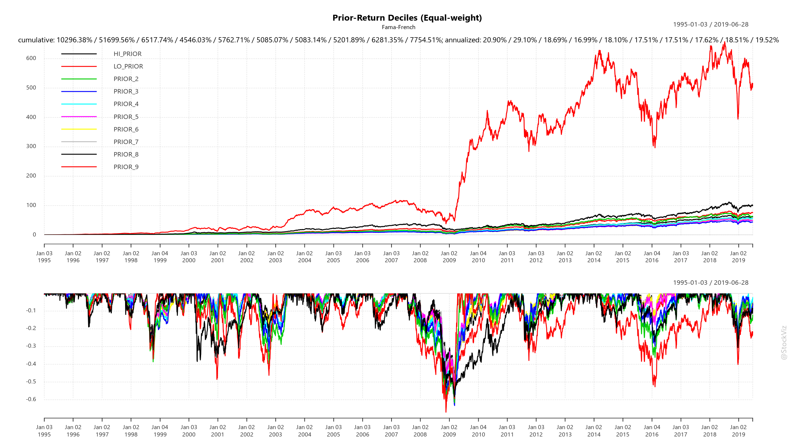
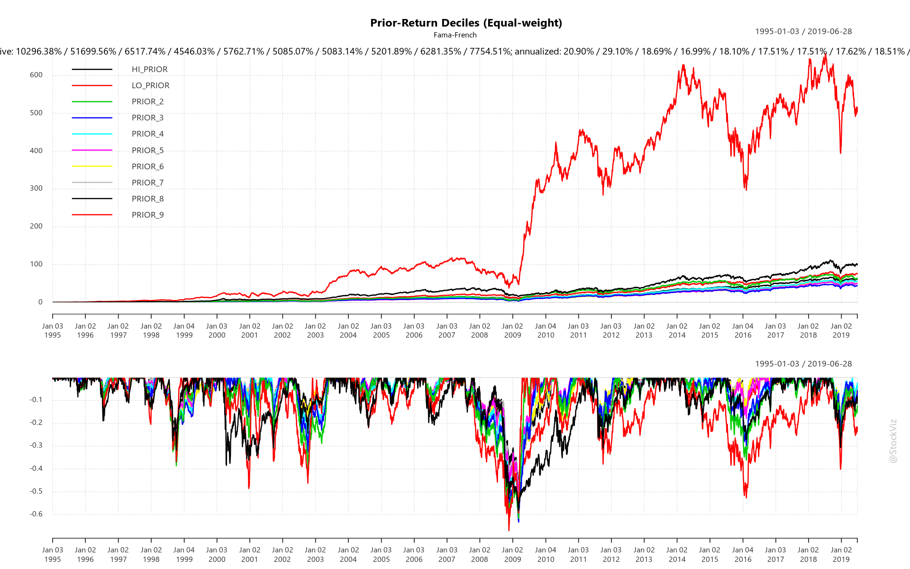
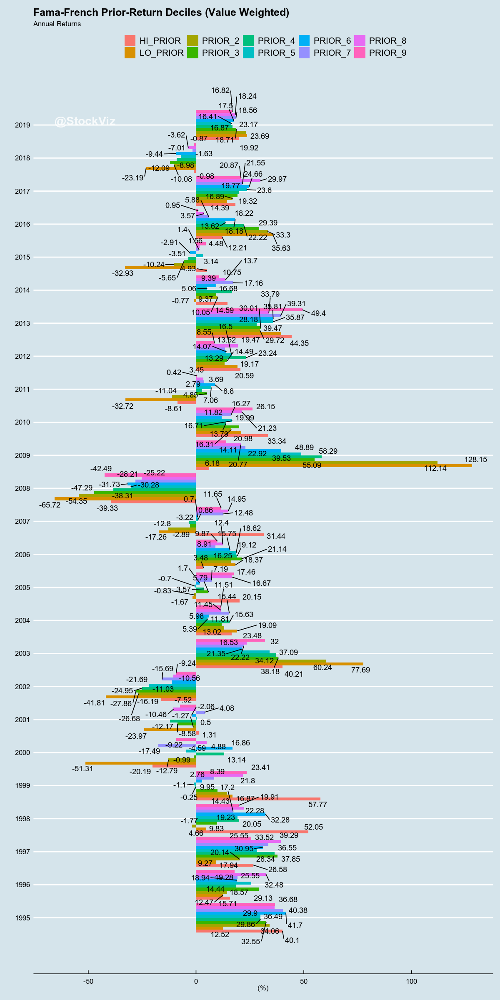
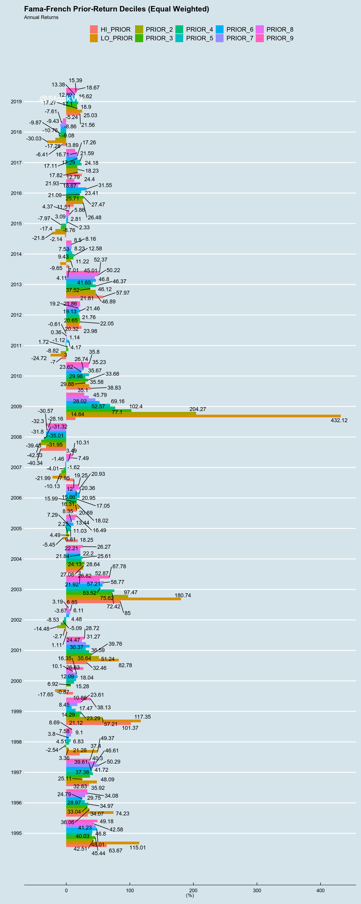

# Momentum Decile Performance

The [Fama-French](https://mba.tuck.dartmouth.edu/pages/faculty/ken.french/Data_Library/det_10_port_form_pr_12_2_daily.html) data-set has returns for portfolios constructed out of each decile of prior returns. Labeled LO_PRIOR, PRIOR_2..9 and HI_PRIOR, they represent portfolios who's prior returns were the lowest through to the highest.

Here, we plot the returns of these portfolios to get a sense for how they have behaved through time.

The documentation for the Fama-French data-set can be found [here](https://plutopy.readthedocs.io/en/latest/FamaFrench.html) and [here](https://shyams80.github.io/plutoR/docs/reference/FamaFrench-class.html)


```R
library(tidyverse)
library(ggthemes)
library(odbc)
library(plutoR)
library(quantmod)
library(lubridate)
library(reshape2)
library(PerformanceAnalytics)
library(ggrepel)
library(tbl2xts)

options("scipen"=999)
options(stringsAsFactors = FALSE)

source("config.R")
source("goofy/plot.common.R")

#initialize
famaFrench <- FamaFrench()
```

    ── Attaching packages ─────────────────────────────────────── tidyverse 1.2.1 ──
    ✔ ggplot2 3.2.1     ✔ purrr   0.3.2
    ✔ tibble  2.1.3     ✔ dplyr   0.8.3
    ✔ tidyr   0.8.3     ✔ stringr 1.4.0
    ✔ readr   1.3.1     ✔ forcats 0.4.0
    ── Conflicts ────────────────────────────────────────── tidyverse_conflicts() ──
    ✖ dplyr::filter() masks stats::filter()
    ✖ dplyr::lag()    masks stats::lag()
    Loading required package: xts
    Loading required package: zoo
    
    Attaching package: ‘zoo’
    
    The following objects are masked from ‘package:base’:
    
        as.Date, as.Date.numeric
    
    Registered S3 method overwritten by 'xts':
      method     from
      as.zoo.xts zoo 
    
    Attaching package: ‘xts’
    
    The following objects are masked from ‘package:dplyr’:
    
        first, last
    
    Loading required package: TTR
    Registered S3 method overwritten by 'quantmod':
      method            from
      as.zoo.data.frame zoo 
    Version 0.4-0 included new data defaults. See ?getSymbols.
    
    Attaching package: ‘lubridate’
    
    The following object is masked from ‘package:base’:
    
        date
    
    
    Attaching package: ‘reshape2’
    
    The following object is masked from ‘package:tidyr’:
    
        smiths
    
    
    Attaching package: ‘PerformanceAnalytics’
    
    The following object is masked from ‘package:graphics’:
    
        legend
    
    Registering fonts with R


```R
calcYearlyReturns <- function(priceXts){
    yRets <- NULL
    for(j in 1:ncol(priceXts)){
        yRets <- merge.xts(yRets, yearlyReturn(priceXts[,j]))
    }
    
    names(yRets) <- names(priceXts)
    return(yRets)
}
```


```R
#startDt <- (famaFrench$MomentumDaily() %>% summarize(MAX = min(TIME_STAMP)) %>% collect())$MAX[[1]]
startDt <- as.Date("1995-01-01")

#value (market-cap) weighted
valueWtd <- famaFrench$MomentumDaily() %>%
    filter(RET_TYPE == 'AVWRD' & TIME_STAMP >= startDt) %>%
    mutate(R = RET/100) %>%
    select(DATE = TIME_STAMP, KEY_ID, R) %>%
    collect() %>% 
    # the KEY_ID column has decile names HI_PRIOR...LO_PRIOR
    # we want HI_PRIOR...LO_PRIOR as column names
    mutate(group=1) %>%
    spread(KEY_ID, R) %>%
    select(-group)
    
valueWtdPx <- valueWtd %>% 
    # transform the return stream to prices
    # and convert to xts
    mutate_each(list(~ cumprod(. + 1) ), -DATE) %>% 
    tbl_xts() 

valueWtdYearlyRet <- 100*calcYearlyReturns(valueWtdPx)
valueWtdDailyRet <- valueWtd %>% 
    tbl_xts()

#equal weighted
equalWtd <- famaFrench$MomentumDaily() %>%
    filter(RET_TYPE == 'AEWRD' & TIME_STAMP >= startDt) %>%
    mutate(R = RET/100) %>%
    select(DATE = TIME_STAMP, KEY_ID, R) %>%
    collect() %>% 
    # the KEY_ID column has decile names HI_PRIOR...LO_PRIOR
    # we want HI_PRIOR...LO_PRIOR as column names
    mutate(group=1) %>%
    spread(KEY_ID, R) %>%
    select(-group)
    
equalWtdPx <- equalWtd %>% 
    # transform the return stream to prices
    # and convert to xts
    mutate_each(list(~ cumprod(. + 1) ), -DATE) %>% 
    tbl_xts() 

equalWtdYearlyRet <- 100*calcYearlyReturns(equalWtdPx)
equalWtdDailyRet <- equalWtd %>% 
    tbl_xts()

```


```R
plotAnnualReturns <- function(yearlies, mainTitle){
    yDf <- data.frame(yearlies)
    yDf$T <- year(index(yearlies))
    
    toPlot <- melt(yDf, id='T')

    ggplot(toPlot, aes(x=T, y=value, fill=variable)) +
        theme_economist() +
        geom_bar(stat="identity", position=position_dodge()) +
        scale_x_continuous(labels=yDf$T, breaks=yDf$T) +
        geom_text_repel(aes(label= round(value, 2)), position = position_dodge(0.9)) +
        coord_flip() +
        labs(x='', y='(%)', fill='', title=mainTitle, subtitle="Annual Returns") +
        annotate("text", x=max(yDf$T), y=min(toPlot$value), 
                 label = "@StockViz", hjust=0, vjust=0, 
                 col="white", cex=6, fontface = "bold", alpha = 0.8)  
}
```


```R
options(repr.plot.width=16, repr.plot.height=10)
```


```R
Common.PlotCumReturns(valueWtdDailyRet, "Prior-Return Deciles (Value-weight)", "Fama-French")
```





```R
Common.PlotCumReturns(equalWtdDailyRet, "Prior-Return Deciles (Equal-weight)", "Fama-French")
```





```R
options(repr.plot.width=10, repr.plot.height=20)
```


```R
plotAnnualReturns(valueWtdYearlyRet, "Fama-French Prior-Return Deciles (Value Weighted)")
```





```R
plotAnnualReturns(equalWtdYearlyRet, "Fama-French Prior-Return Deciles (Equal Weighted)")
```





This notebook was created using [pluto](http://pluto.studio). Learn more [here](https://github.com/shyams80/pluto)
